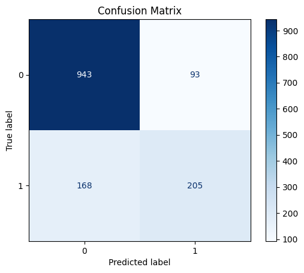
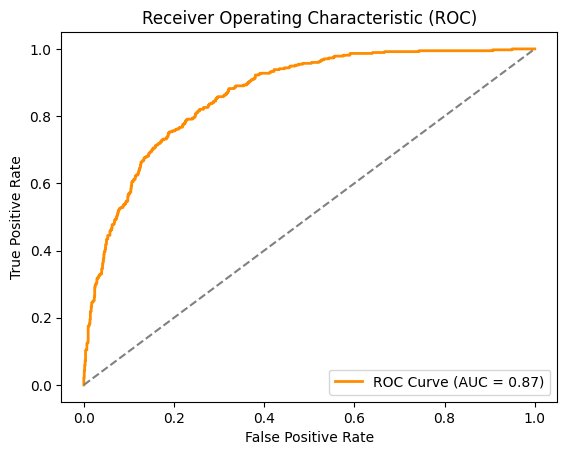

# 📊 Telco Churn Classification

A professional data science project focused on classifying customer churn in the telecommunications industry. This project includes exploratory data analysis (EDA), feature engineering, and implementation of multiple machine learning models to predict customer churn using Python.

---

## 📁 Project Structure

```bash
telco-churn-classification/
├── data/                # Dataset files (original and processed)
├── notebooks/           # Jupyter notebooks for EDA and modeling
├── scripts/             # Python scripts for modular workflows
├── results/             # Output visuals (plots, confusion matrices, etc.)
├── requirements.txt     # List of Python dependencies
└── README.md            # Project overview and instructions
```

---

## 🧠 Objective
The goal of this project is to predict whether a customer will churn based on features such as tenure, contract type, services subscribed, and billing behavior. This helps businesses reduce churn by proactively identifying high-risk customers.

---

## 🔍 Exploratory Data Analysis (EDA)
- Distribution analysis of numerical and categorical features
- Correlation heatmaps and feature importance
- Churn rate breakdown by customer attributes

---

## 🤖 Machine Learning Models
Implemented and evaluated the following models:
- Logistic Regression
- Decision Tree
- Random Forest
- Support Vector Machines (SVM)
- k-Nearest Neighbors (k-NN)

Models are evaluated based on accuracy, precision, recall, F1-score, and ROC-AUC.

---

## 📈 Results & Visuals
Example outputs include confusion matrices and ROC curves.





---

## ⚙️ Getting Started

### Prerequisites
- Python 3.7+
- Recommended: Use a virtual environment

### Installation
```bash
git clone https://github.com/Anindo21/telco-churn-classification.git
cd telco-churn-classification
python -m venv venv
source venv/bin/activate  # On Windows: venv\Scripts\activate
pip install -r requirements.txt
```

### Running Notebooks
```bash
jupyter notebook
```
Navigate to `notebooks/` and open the desired `.ipynb` file.

---

## 🧪 Dataset
This project uses the [Telco Customer Churn dataset](https://www.kaggle.com/blastchar/telco-customer-churn) available on Kaggle. It includes customer account information, services used, and churn labels.

---

## 📄 License
This project is licensed under the MIT License. See the [LICENSE](LICENSE) file for more information.

---

## 🙌 Acknowledgements
- [Kaggle Dataset](https://www.kaggle.com/blastchar/telco-customer-churn)
- [Scikit-learn](https://scikit-learn.org/)
- [Seaborn](https://seaborn.pydata.org/)
- [Matplotlib](https://matplotlib.org/)

---

Feel free to ⭐ the repository and contribute!
